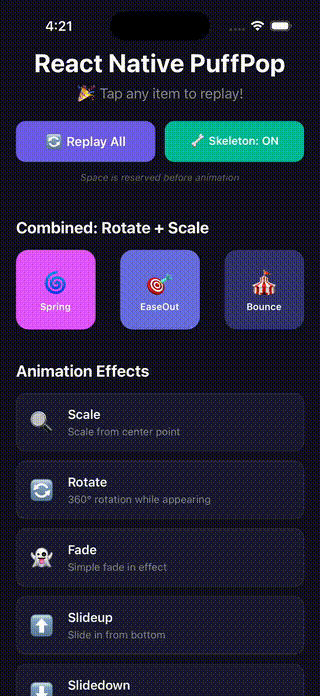

# react-native-puff-pop 🎉

A React Native animation library for revealing children components with beautiful puff and pop effects.

Works with both **React Native CLI** and **Expo** projects - no native dependencies required!


## Demo

<p align="center">
  
</p>

## Features

- 🎬 **16 Animation Effects**: scale, rotate, fade, slideUp/Down/Left/Right, bounce, flip, zoom, rotateScale, shake, pulse, swing, wobble, elastic
- 🎯 **Exit Animations**: Different effects for enter and exit animations
- 🔄 **Reverse Mode**: Reverse animation direction with a single prop
- 🎛️ **Custom Initial Values**: Fine-tune starting opacity, scale, rotation, and position
- 📊 **Animation Intensity**: Control how dramatic your animations are (0-1)
- 📍 **Anchor Point**: Set transform origin for scale/rotate (top, bottom, corners, etc.)
- 🦴 **Skeleton Mode**: Reserve space before animation or expand from zero height
- ⚡ **Native Driver Support**: Smooth 60fps animations
- 🎯 **Easy to Use**: Just wrap your components with `<PuffPop>`
- 📱 **Cross Platform**: Works on iOS, Android, and Web
- 🔧 **TypeScript**: Full TypeScript support with type definitions

## Installation

```bash
# Using npm
npm install react-native-puff-pop

# Using yarn
yarn add react-native-puff-pop
```

## Usage

### Basic Usage

```tsx
import { PuffPop } from 'react-native-puff-pop';

function App() {
  return (
    <PuffPop>
      <View style={styles.card}>
        <Text>Hello, PuffPop!</Text>
      </View>
    </PuffPop>
  );
}
```

### With Different Effects

```tsx
// Scale from center (default)
<PuffPop effect="scale">
  <YourComponent />
</PuffPop>

// Rotate while appearing
<PuffPop effect="rotate">
  <YourComponent />
</PuffPop>

// Rotate + Scale combined
<PuffPop effect="rotateScale" easing="spring">
  <YourComponent />
</PuffPop>

// Bounce effect
<PuffPop effect="bounce" duration={600}>
  <YourComponent />
</PuffPop>

// Slide from bottom
<PuffPop effect="slideUp">
  <YourComponent />
</PuffPop>

// 3D Flip effect
<PuffPop effect="flip">
  <YourComponent />
</PuffPop>
```

### Skeleton Mode

By default, `skeleton={true}` reserves space for the component before animation:

```tsx
// Reserves space (default)
<PuffPop skeleton={true}>
  <YourComponent />
</PuffPop>

// Expands from zero height, pushing content below
<PuffPop skeleton={false}>
  <YourComponent />
</PuffPop>
```

### Staggered Animations

Use `PuffPopGroup` for easy staggered animations:

```tsx
import { PuffPopGroup } from 'react-native-puff-pop';

// Simple stagger
<PuffPopGroup staggerDelay={100} effect="scale">
  <Card title="First" />
  <Card title="Second" />
  <Card title="Third" />
</PuffPopGroup>

// With different directions
<PuffPopGroup staggerDelay={80} staggerDirection="reverse">
  <Item />
  <Item />
  <Item />
</PuffPopGroup>

// Horizontal layout with gap
<PuffPopGroup horizontal gap={12} effect="slideUp">
  <Avatar />
  <Avatar />
  <Avatar />
</PuffPopGroup>
```

Or use manual delays with `PuffPop`:

```tsx
<View>
  <PuffPop delay={0}>
    <Card title="First" />
  </PuffPop>
  <PuffPop delay={100}>
    <Card title="Second" />
  </PuffPop>
  <PuffPop delay={200}>
    <Card title="Third" />
  </PuffPop>
</View>
```

### Controlled Visibility

```tsx
function App() {
  const [visible, setVisible] = useState(false);

  return (
    <>
      <Button title="Toggle" onPress={() => setVisible(!visible)} />
      <PuffPop visible={visible} animateOnMount={false}>
        <YourComponent />
      </PuffPop>
    </>
  );
}
```

### Loop Animation

```tsx
// Loop infinitely
<PuffPop effect="rotate" loop={true}>
  <LoadingSpinner />
</PuffPop>

// Loop 3 times
<PuffPop effect="bounce" loop={3}>
  <NotificationBadge />
</PuffPop>

// Loop with delay between iterations
<PuffPop effect="scale" loop={true} loopDelay={500}>
  <PulsingDot />
</PuffPop>
```

### Exit Animation

Use different effects for enter and exit animations:

```tsx
// Scale in, fade out
<PuffPop 
  effect="scale" 
  exitEffect="fade"
  visible={isVisible}
>
  <Modal />
</PuffPop>

// Slide up to enter, slide down to exit
<PuffPop 
  effect="slideUp" 
  exitEffect="slideDown"
  exitDuration={200}
  visible={isVisible}
>
  <Toast />
</PuffPop>

// Different timing for enter and exit
<PuffPop 
  effect="zoom"
  duration={400}
  easing="spring"
  exitEffect="fade"
  exitDuration={150}
  exitEasing="easeIn"
  exitDelay={50}
  visible={isVisible}
>
  <Notification />
</PuffPop>
```

With `PuffPopGroup`:

```tsx
<PuffPopGroup
  effect="slideUp"
  exitEffect="fade"
  exitDuration={150}
  staggerDelay={50}
  visible={isVisible}
>
  <ListItem />
  <ListItem />
  <ListItem />
</PuffPopGroup>
```

### Exit Stagger Animation

Stagger the exit animation of group children:

```tsx
// Children exit one by one in reverse order (last first)
<PuffPopGroup
  staggerDelay={50}
  exitStaggerDelay={50}
  exitStaggerDirection="reverse"
  visible={isVisible}
>
  <ListItem />
  <ListItem />
  <ListItem />
</PuffPopGroup>

// Children exit from center outward
<PuffPopGroup
  exitStaggerDelay={30}
  exitStaggerDirection="center"
  visible={isVisible}
>
  <MenuItem />
  <MenuItem />
  <MenuItem />
  <MenuItem />
  <MenuItem />
</PuffPopGroup>
```

Exit stagger directions:
- `forward`: First child exits first
- `reverse`: Last child exits first (default, LIFO)
- `center`: Center children exit first
- `edges`: Edge children exit first

### Custom Initial Values

Fine-tune the starting values of your animations:

```tsx
// Start from 50% opacity instead of 0
<PuffPop initialOpacity={0.5}>
  <Card />
</PuffPop>

// Start from a larger scale
<PuffPop effect="scale" initialScale={0.5}>
  <Avatar />
</PuffPop>

// Custom slide distance
<PuffPop effect="slideUp" initialTranslateY={200}>
  <Modal />
</PuffPop>

// Combine multiple custom values
<PuffPop
  effect="rotateScale"
  initialOpacity={0.3}
  initialScale={0.2}
  initialRotate={-90}
>
  <Icon />
</PuffPop>
```

### Reverse Mode

Reverse the animation direction:

```tsx
// slideUp now slides from top instead of bottom
<PuffPop effect="slideUp" reverse>
  <Toast />
</PuffPop>

// slideLeft now slides from left instead of right
<PuffPop effect="slideLeft" reverse>
  <Drawer />
</PuffPop>

// rotate spins clockwise instead of counter-clockwise
<PuffPop effect="rotate" reverse>
  <Spinner />
</PuffPop>
```

With `PuffPopGroup`:

```tsx
<PuffPopGroup effect="slideRight" reverse staggerDelay={50}>
  <MenuItem />
  <MenuItem />
  <MenuItem />
</PuffPopGroup>
```

### Animation Intensity

Control how dramatic your animations are with the `intensity` prop (0-1):

```tsx
// Full animation (default)
<PuffPop effect="slideUp" intensity={1}>
  <Card />
</PuffPop>

// Half the movement distance (25px instead of 50px)
<PuffPop effect="slideUp" intensity={0.5}>
  <Card />
</PuffPop>

// Subtle animation (10px slide)
<PuffPop effect="slideUp" intensity={0.2}>
  <Tooltip />
</PuffPop>

// No movement, just fade (intensity 0)
<PuffPop effect="slideUp" intensity={0}>
  <Content />
</PuffPop>
```

Works with all effects:

```tsx
// Smaller scale range (starts at 0.5 instead of 0)
<PuffPop effect="scale" intensity={0.5}>
  <Avatar />
</PuffPop>

// Less rotation (180deg instead of 360deg)
<PuffPop effect="rotate" intensity={0.5}>
  <Icon />
</PuffPop>
```

With `PuffPopGroup`:

```tsx
<PuffPopGroup effect="slideLeft" intensity={0.3} staggerDelay={50}>
  <ListItem />
  <ListItem />
  <ListItem />
</PuffPopGroup>
```

### Anchor Point

Set the transform origin for scale/rotate animations:

```tsx
// Scale from top (expands downward)
<PuffPop effect="scale" anchorPoint="top">
  <DropdownMenu />
</PuffPop>

// Scale from bottom-left corner
<PuffPop effect="scale" anchorPoint="bottomLeft">
  <Tooltip />
</PuffPop>

// Rotate from top-left (door-opening effect)
<PuffPop effect="rotate" anchorPoint="topLeft">
  <Panel />
</PuffPop>

// Flip from right edge
<PuffPop effect="flip" anchorPoint="right">
  <Card />
</PuffPop>
```

Available anchor points:

| Value | Description |
|-------|-------------|
| `center` | Default center point |
| `top` | Top center |
| `bottom` | Bottom center |
| `left` | Left center |
| `right` | Right center |
| `topLeft` | Top-left corner |
| `topRight` | Top-right corner |
| `bottomLeft` | Bottom-left corner |
| `bottomRight` | Bottom-right corner |

## Props

| Prop | Type | Default | Description |
|------|------|---------|-------------|
| `children` | `ReactNode` | - | Children to animate |
| `effect` | `PuffPopEffect` | `'scale'` | Animation effect type |
| `duration` | `number` | `400` | Animation duration in ms |
| `delay` | `number` | `0` | Delay before animation starts in ms |
| `easing` | `PuffPopEasing` | `'easeOut'` | Easing function |
| `skeleton` | `boolean` | `true` | Reserve space before animation |
| `visible` | `boolean` | `true` | Control visibility |
| `animateOnMount` | `boolean` | `true` | Animate when component mounts |
| `onAnimationStart` | `() => void` | - | Callback when animation starts |
| `onAnimationComplete` | `() => void` | - | Callback when animation completes |
| `style` | `ViewStyle` | - | Custom container style |
| `loop` | `boolean \| number` | `false` | Loop animation (true=infinite, number=times) |
| `loopDelay` | `number` | `0` | Delay between loop iterations in ms |
| `respectReduceMotion` | `boolean` | `true` | Respect system reduce motion setting |
| `testID` | `string` | - | Test ID for testing purposes |
| `exitEffect` | `PuffPopEffect` | - | Animation effect for exit (defaults to enter effect) |
| `exitDuration` | `number` | - | Duration for exit animation (defaults to duration) |
| `exitEasing` | `PuffPopEasing` | - | Easing for exit animation (defaults to easing) |
| `exitDelay` | `number` | `0` | Delay before exit animation starts in ms |
| `initialOpacity` | `number` | - | Custom initial opacity (0-1) |
| `initialScale` | `number` | - | Custom initial scale value |
| `initialRotate` | `number` | - | Custom initial rotation in degrees |
| `initialTranslateX` | `number` | - | Custom initial X translation in pixels |
| `initialTranslateY` | `number` | - | Custom initial Y translation in pixels |
| `reverse` | `boolean` | `false` | Reverse animation direction |
| `intensity` | `number` | `1` | Animation intensity multiplier (0-1) |
| `anchorPoint` | `PuffPopAnchorPoint` | `'center'` | Transform origin for scale/rotate |

### PuffPopGroup Props

| Prop | Type | Default | Description |
|------|------|---------|-------------|
| `children` | `ReactNode` | - | Children to animate with stagger effect |
| `effect` | `PuffPopEffect` | `'scale'` | Animation effect for all children |
| `duration` | `number` | `400` | Animation duration for each child in ms |
| `staggerDelay` | `number` | `100` | Delay between each child's animation in ms |
| `initialDelay` | `number` | `0` | Delay before the first child animates in ms |
| `easing` | `PuffPopEasing` | `'easeOut'` | Easing function for all children |
| `skeleton` | `boolean` | `true` | Reserve space before animation |
| `visible` | `boolean` | `true` | Control visibility of all children |
| `animateOnMount` | `boolean` | `true` | Animate when component mounts |
| `onAnimationStart` | `() => void` | - | Callback when first child starts animating |
| `onAnimationComplete` | `() => void` | - | Callback when all children complete |
| `style` | `ViewStyle` | - | Custom container style |
| `staggerDirection` | `'forward' \| 'reverse' \| 'center' \| 'edges'` | `'forward'` | Direction of stagger animation |
| `horizontal` | `boolean` | `false` | Render children in horizontal layout |
| `gap` | `number` | - | Gap between children |
| `respectReduceMotion` | `boolean` | `true` | Respect system reduce motion setting |
| `testID` | `string` | - | Test ID for testing purposes |
| `exitEffect` | `PuffPopEffect` | - | Exit animation effect for all children |
| `exitDuration` | `number` | - | Exit duration for all children |
| `exitEasing` | `PuffPopEasing` | - | Exit easing for all children |
| `exitDelay` | `number` | `0` | Exit delay for all children |
| `initialOpacity` | `number` | - | Custom initial opacity for all children |
| `initialScale` | `number` | - | Custom initial scale for all children |
| `initialRotate` | `number` | - | Custom initial rotation for all children |
| `initialTranslateX` | `number` | - | Custom initial X translation for all children |
| `initialTranslateY` | `number` | - | Custom initial Y translation for all children |
| `reverse` | `boolean` | `false` | Reverse animation direction for all children |
| `intensity` | `number` | `1` | Animation intensity multiplier for all children |
| `anchorPoint` | `PuffPopAnchorPoint` | `'center'` | Transform origin for all children |
| `exitStaggerDelay` | `number` | `0` | Delay between each child's exit animation |
| `exitStaggerDirection` | `'forward' \| 'reverse' \| 'center' \| 'edges'` | `'reverse'` | Direction of exit stagger |

### Animation Effects (`PuffPopEffect`)

| Effect | Description |
|--------|-------------|
| `scale` | Scale from center point |
| `rotate` | Full rotation (360°) while appearing |
| `fade` | Simple fade in |
| `slideUp` | Slide from bottom |
| `slideDown` | Slide from top |
| `slideLeft` | Slide from right |
| `slideRight` | Slide from left |
| `bounce` | Bounce effect with overshoot |
| `flip` | 3D flip effect |
| `zoom` | Zoom with slight overshoot |
| `rotateScale` | Rotate + Scale combined |
| `shake` | Shake left-right (for alerts, errors) |
| `pulse` | Pulse heartbeat effect (for emphasis) |
| `swing` | Swing like pendulum (for menus) |
| `wobble` | Wobble with tilt (playful entrance) |
| `elastic` | Elastic stretch effect (springy feel) |

### Easing Types (`PuffPopEasing`)

| Easing | Description |
|--------|-------------|
| `linear` | Linear animation |
| `easeIn` | Slow start |
| `easeOut` | Slow end |
| `easeInOut` | Slow start and end |
| `spring` | Spring-like effect |
| `bounce` | Bouncing effect |

## Skeleton Mode Explained

### `skeleton={true}` (default)
The component reserves its full space immediately, and only the visual appearance animates. This is useful when you don't want layout shifts.

### `skeleton={false}`
The component's height starts at 0 and expands during animation, pushing other content below it. This creates a more dynamic entrance effect.

## Accessibility

PuffPop respects the system's "Reduce Motion" accessibility setting by default. When users have enabled reduce motion in their device settings, animations will be instant (0 duration) to avoid discomfort.

```tsx
// Respect reduce motion setting (default)
<PuffPop respectReduceMotion={true}>
  <YourComponent />
</PuffPop>

// Ignore reduce motion setting (always animate)
<PuffPop respectReduceMotion={false}>
  <YourComponent />
</PuffPop>
```

## License

MIT

## Contributing

Contributions are welcome! Please feel free to submit a Pull Request.
